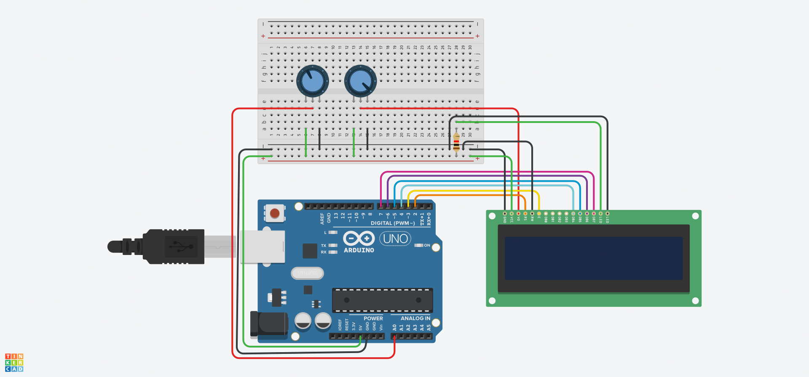

# Voltage Value Displayer

This project measures the analog voltage from an input source using an Arduino, calculates both the real-time voltage and the average voltage over multiple readings, and displays these values on an LCD screen.

## Components
- Arduino Uno (or compatible)
- LCD display
- 2 potentiometers (min. 10kΩ)
- Connecting wires
- Breadboard

## Schematic diagram

## How it Works:
1. The system reads an analog voltage from the input source (e.g., a voltage divider) connected to the A0 pin of the Arduino.
2. The ADC (Analog-to-Digital Converter) of the Arduino converts the analog signal into a digital value, which is then converted into a corresponding voltage value.
3. The real-time voltage is displayed on the first row of the LCD screen, updated every 200ms.
4. Simultaneously, the system calculates the average voltage from 50 readings taken every 20ms and displays this value on the second row of the LCD.

## License
This project is open-source and available under the [MIT License](LICENSE).
